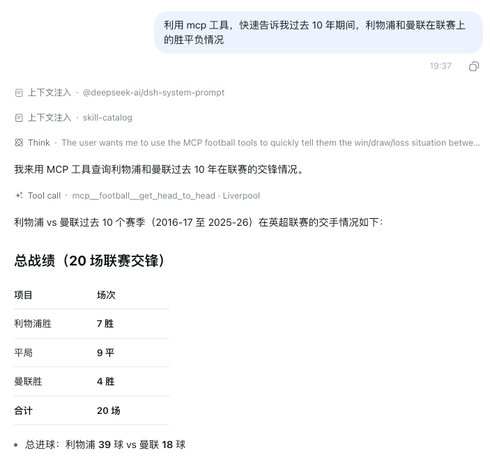

# football-data-mcp

[](https://www.npmjs.com/package/football-data-mcp)
[](https://www.npmjs.com/package/football-data-mcp)
[](#license)
[](#)
[](#)

为任意 Agent 提供足球数据的MCP服务器：比赛结果、统计、赔率，以及积分榜、近期状态、历史交锋等分析，覆盖 18 个欧洲联赛（1993-94 至今）和 8 个杯赛。



## 数据来源

| | [football-data.co.uk]（基座） | [ESPN scoreboard]（增强） |
|---|---|---|
| **定位** | 深度：历史 + 完整赔率 | 新鲜度：分钟级 + 杯赛 |
| **覆盖** | 18 个联赛 · 1993-94 至今 | 8 个杯赛 · 约 2001 至今 |
| **每场数据** | 比分、半场比分、裁判<br>射门 / 角球 / 犯规 / 红黄牌<br>约 20 家博彩的 1X2 开盘+收盘、Pinnacle、大小球 2.5、亚洲让球 | 比分、开球时间、球队统计<br>控球率、助攻 |
| **新鲜度** | 终场后数小时到一天 | 终场后几分钟，含 live 状态 |

### 支持的联赛清单

| 联赛（football-data） | 杯赛（ESPN） |
|---|---|
| 英格兰：英超 `E0`、英冠 `E1`、英甲 `E2`、英乙 `E3` | 英格兰：足总杯 `FA`、联赛杯 `LC` |
| 苏格兰：苏超 `SC0` | 西班牙：国王杯 `CDR` |
| 德国：德甲 `D1`、德乙 `D2` | 意大利：意大利杯 `CI` |
| 意大利：意甲 `I1`、意乙 `I2` | 德国：德国杯 `DFB` |
| 西班牙：西甲 `SP1`、西乙 `SP2` | 法国：法国杯 `CDF` |
| 法国：法甲 `F1`、法乙 `F2` | 欧洲：欧冠 `UCL`、欧联 `UEL` |
| 荷兰：荷甲 `N1` · 比利时：比甲 `B1` | |
| 葡萄牙：葡超 `P1` · 土耳其：土超 `T1` · 希腊：希超 `G1` | |

## Tools

| Tool | 我能用它做什么 |
|---|---|
| `list_competitions()` | 查看支持哪些联赛及其代码 |
| `list_teams(competition, season)` | 查看某联赛某赛季有哪些球队（球队过滤前先查这个） |
| `get_matches(...)` | 查比赛结果/赛程，可按球队、日期、已赛/未赛过滤，可选统计与赔率 |
| `get_standings(competition, season, as_of_date?)` | 查联赛积分榜，用 `as_of_date` 还能回看某天之前的排名 |
| `get_team_form(team, ...)` | 查某队最近 N 场战绩与胜平负、进失球、场均积分 |
| `get_head_to_head(a, b, ...)` | 查两队历史交锋的胜负平与进球，可按联赛/杯赛/具体赛事分组 |
| `list_cup_competitions()` | 查看支持哪些杯赛及其代码 |
| `get_cup_matches(...)` | 查杯赛对阵，含点球决胜与两回合说明 |

值得知道的语义：点球决胜在交锋统计中计为点球获胜方的胜利（用 `pen_wins_a/b` 披露）；进球只统计常规时间和加时；积分榜不包含行政扣分（源数据里没有）。

## 安装

### 前置要求

- **Node.js ≥ 18**（运行 `npx`）
- **[`uv`](https://docs.astral.sh/uv/)**（Python 服务器由它启动，需在 `PATH` 上）
- 无需任何 API Key

### Claude Desktop / Cursor / 任意 stdio MCP 客户端

```json
{
  "mcpServers": {
    "football": {
      "command": "npx",
      "args": ["-y", "football-data-mcp"]
    }
  }
}
```

### Codex

```bash
codex mcp add football -- npx -y football-data-mcp
```

### DeepSeek Harness（dsh）

```bash
dsh plugin --profile web add football-data-mcp
```

在每个 dsh 会话中，工具以 `mcp__football__get_matches`、… 的形式出现。

## 本地开发

```bash
git clone https://github.com/HOWILLMAKEIT/football-mcp && cd football-mcp
uv sync --extra dev
```

运行服务器（冒烟测试，应返回服务器能力）：

```bash
echo '{"jsonrpc":"2.0","id":1,"method":"initialize","params":{"protocolVersion":"2026-07-28","capabilities":{},"clientInfo":{"name":"probe","version":"0"}}}' \
  | node bin/cli.mjs
```

或让 MCP 客户端直接指向 `uv --directory <repo> run football-data-mcp`。

### 配置

| 环境变量 | 默认值 | 用途 |
|---|---|---|
| `FOOTBALL_MCP_CACHE_DIR` | `~/.cache/football_mcp` | CSV/ESPN 缓存目录 |

### 测试与检查

```bash
uv run pytest      # 76 个离线测试
uv run ruff check .
```

## 示例

```
用户:  过去 10 个赛季国家德比，巴萨对皇马胜率？含杯赛
Agent: get_head_to_head("Barcelona", "Real Madrid", "SP1", "2025-26",
                        seasons_back=9, scope="all")
→      25 次交锋：巴萨 12 胜（48%）、皇马 9 胜（36%）、4 平
       by_scope: 联赛 20 场（9-8-3）· 国内杯 5 场（3-1-1）
```

## 贡献

欢迎提交 Issue 和 PR。开发流程：

1. Fork 并克隆仓库，`uv sync --extra dev` 安装开发依赖；
2. 改动后运行测试与代码检查，确保全部通过：

   ```bash
   uv run pytest
   uv run ruff check .
   ```

3. 提交前用 `npm pack --dry-run` 检查发布包内容是否完整。

## License

MIT

[football-data.co.uk]: https://www.football-data.co.uk/
[ESPN scoreboard]: https://site.api.espn.com/apis/site/v2/sports/soccer/eng.1/scoreboard
